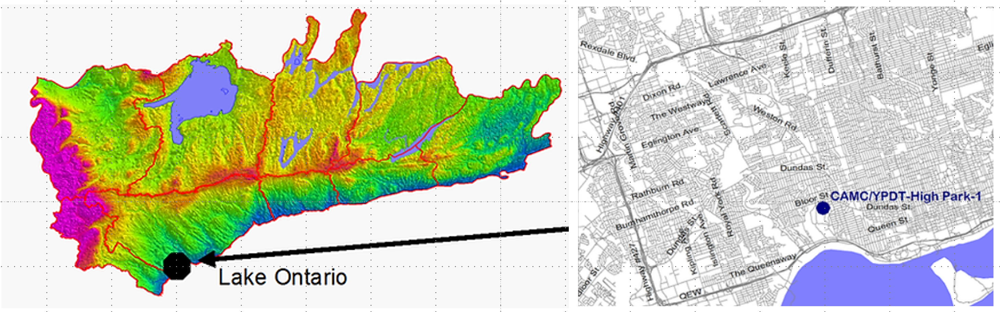
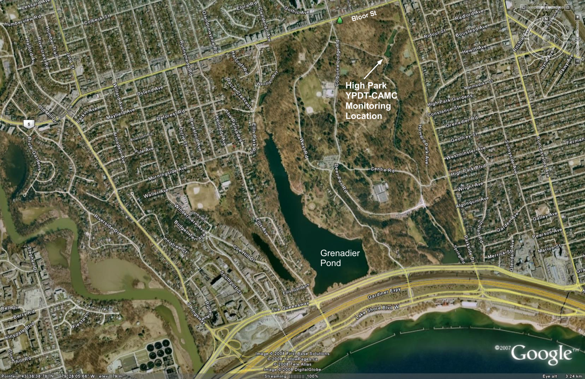
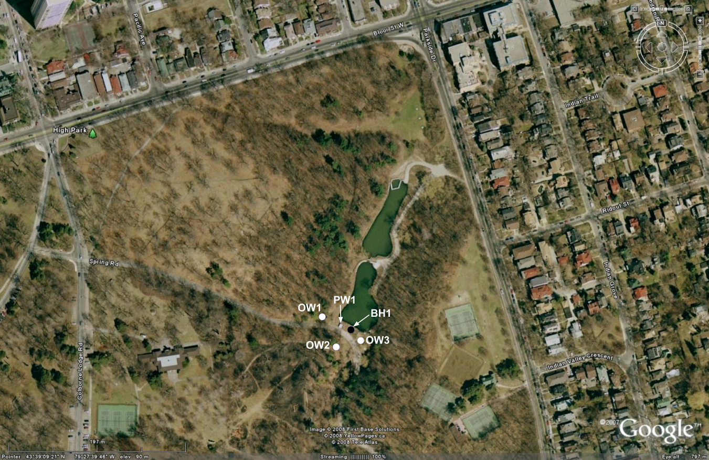
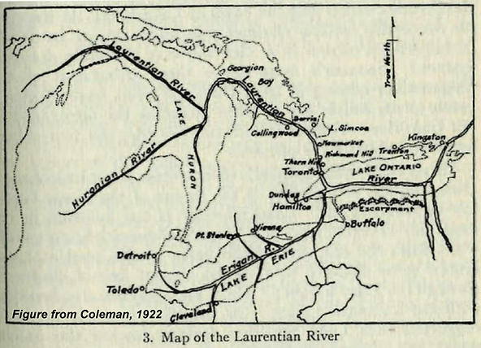
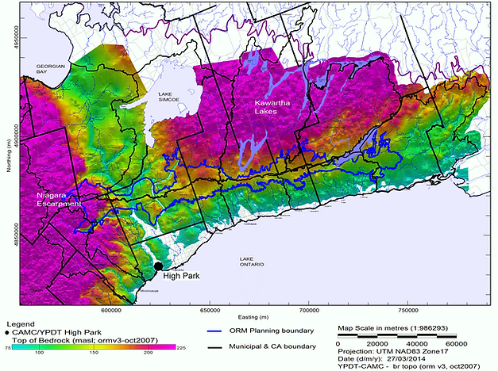
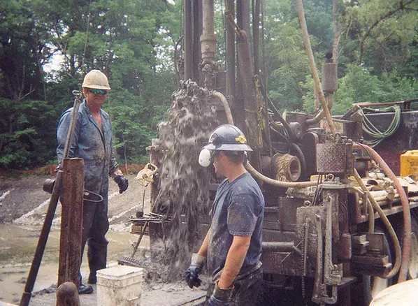
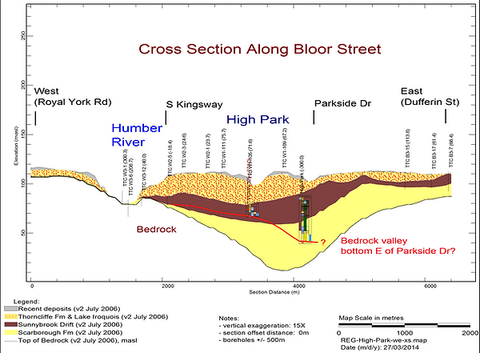
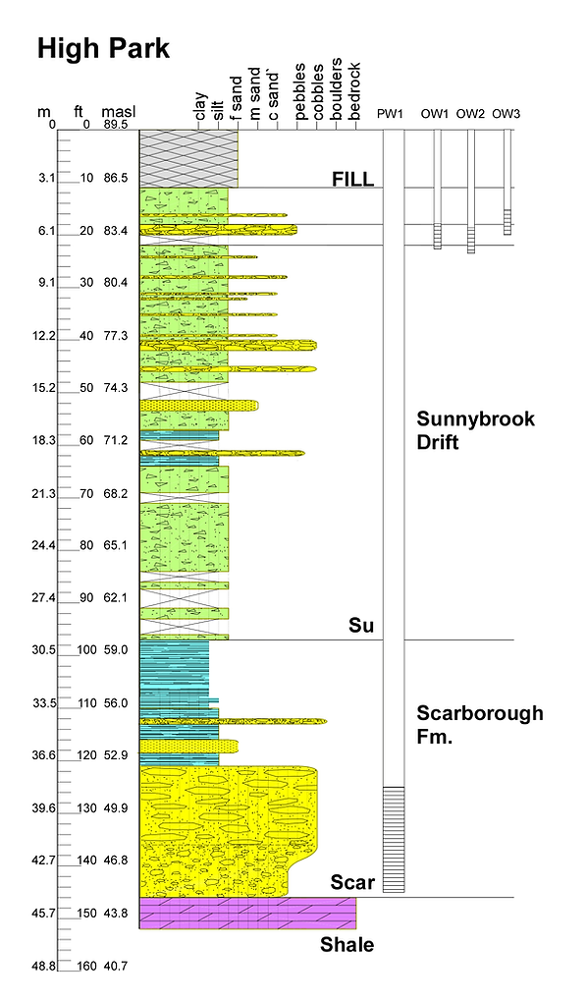

# Introduction

_Figure 1: Location of High Park_

As part of a stormwater management project in High Park in 2003 , the City of Toronto was decommissioning two flowing wells that were first drilled in 1959. The flowing wells were found during construction work on the existing stormwater ponds located in the northeast corner of High Park (Figures 1, 2 and 3). Well records for the deepest well indicated that bedrock had not been encountered when the well was terminated at a depth of 38.4 m below ground surface (mbgs; 126 ft bgs). Based on this, as well as on previous investigations (e.g. Eyles, 1987; Eyles et al., 1993; Gill and Greenhouse, 1996; Lewis and Sly, 1971; Rogers et al., 1961; Sharpe, 1980; Watt, 1968; White and Karrow, 1971) it was suspected that one of the main outlets of the Laurentian River (Figure 4), a significant pre-glacial bedrock valley, was located in the vicinity of High Park. Because there are few high-quality boreholes within the City of Toronto, the ORMGP study (formerly YPDT-CAMC), sought to fill this data gap by drilling a high-quality continuously cored borehole in this valley feature.

Figure 5 shows the interpreted bedrock topography across the program study area. It has been constructed utilizing all of the existing boreholes in the database that have progressed through the glacial sediments to intersect bedrock. The Laurentian Channel is thought to connect Georgian Bay to Lake Ontario and may be a significant conductor of groundwater on a regional scale. The main channel has been traced north to Nobleton, continuing northward trending west of Barrie, and up into Georgian Bay with tributaries extending as far west as the Niagara Escarpment near Caledon East. The High Park monitoring location is shown to be situated coincident with the interpreted west branch of the Laurentian Channel in the Toronto area. The detailed bedrock in the Toronto area is being re-interpreted based on newly drilled boreholes in the Toronto area.

Details regarding the sediment stratigraphy within the Laurentian valley and groundwater movement within the feature remain sketchy despite the valley having been known for over 100 years (Spencer, 1881; 1890). These details are collected and incorporated into the latest interpretation as data becomes available. 

_Figure 2: High Park Area of Toronto_

_Figure 3: Northeast corner of High Park_

_Figure 4: Interpreted Laurentian river system (Figure from Coleman, 1922)_

_Figure 5: Interpreted bedrock topography for south central Ontario_

A summary of events and conditions at the site is as follows:
- An initial borehole (BH1) was drilled to the top of a gravel aquifer at 37 mbgs in July 2003 by All-Terrain Drilling;
- The borehole started flowing from 37 m depth during drilling, expelling water and sediment into the air (initial hydraulic head was on the order of 18 to 23 m above ground surface);
- Initial flow was estimated at 300 to 500 IGPM but declined to between 90 and 120 IGPM after stabilizing;
- Packing off the borehole within the casing resulted in the two recently capped artesian wells situated within the stormwater ponds to begin to flow again and springs emerged from the area surrounding the borehole;
- Installation and pumping of a relief production well (PW1 drilled by G. Hart and Sons) depressurized the aquifer sufficiently to allow for the initial borehole and springs to be grouted;
- In PW1, bedrock was encountered at a depth of 44 mbgs (45 mASL or 30 m lower than the average Lake Ontario water level);
- Water levels in three shallow monitoring wells (OW1, OW2, OW3) show connection to the deeper aquifer;
- Controlled flow from the relief well (PW1) to a local creek continues to depressurize the aquifer; and
- Monitoring of groundwater levels and flow rates is ongoing.

_Figure 6: All-Terrain drilling crew working on BH1, July 2003 (Photo by S. Holysh)_

_Figure 7: West-East cross section along Bloor Street_

_Figure 8: High Park BH1 & PW1 geologic profile showing well installations_

