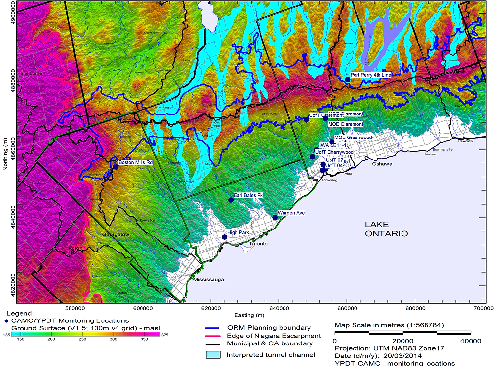

# Monitoring Sites

Groundwater information is collected on an on-going basis at various locations within the program study area. 

This information includes groundwater levels, groundwater temperature and chemical analyses.  Within the study area there are three main groundwater monitoring networks:
1. ORMGP monitoring network;
2. Provincial Groundwater Monitoring Network (PGMN) operated by the Ontario Ministry of the Environment and partner             Conservation Authorities; and
3. Monitoring by municipalities (York, Peel, Durham) associated with water supply from groundwater sources.

**Figure 1:** ORMGP Groundwater Monitoring Locations.

The ORMGP groundwater monitoring network collects information from select locations shown on Figure 1 and listed in Table 1.  Some of the monitoring facilities were installed by program staff and some locations were inherited from other programs as indicated in the table.  The flow system occurring with the study area is interpreted to contain various "hydrogeologic settings" including: 
* Bedrock Valley systems carved by river and glacial erosion;
* Tunnel Channel settings where meltwater beneath glacial ice has eroded to various depths into existing geologic deposits;
* Till Plain settings where the alternating glacial-interglacial deposits laid down over the last approximately 125,000 years remain largely intact; and
* The Lake Iroquois Plain situated along the north shore of Lake Ontario.

The data collected from the various monitoring locations (Figure 2) are used to interpret the behaviour or response of the various hydrogeologic settings, and ultimately to build this knowledge into the regional flow system understanding.

 

**Table 1:** ORMGP Groundwater Monitoring Locations.

| YPDT-CAMC Site | Installed By | Install Date | Hydrogeologic Setting |
| ---- | ---- | ---- | ---- |
| Boston Mills Road | ORMGP | Sept, 2006 | Bedrock Valley |
| High Park | ORMGP | Sept, 2003 | Bedrock Valley |
| Earl Bales Park | ORMGP | Sept, 2006 | Till Plain |
| Warden Avenue | Golder Assoc. for the City of Toronto | July, 2011 | Till Plain |
| UofT 02 (Frenchman’s Bay) | U of Toronto, M. Meriano, PhD 2007 | Dec, 2008 | Lake Iroquois Plain |
| UofT 04 (Frenchman’s Bay) | U of Toronto, M. Meriano, PhD 2007 | Dec, 2008 | Lake Iroquois Plain |
| UofT 05 (Frenchman’s Bay) | U of Toronto, M. Meriano, PhD 2007 | Dec, 2008 | Lake Iroquois Plain |
| UofT 07 (Frenchman’s Bay) | U of Toronto, M. Meriano, PhD 2007 | Dec, 2008 | Lake Iroquois Plain |
| UofT Cherrywood | U of Toronto, R. Gerber, PhD 1999 | Oct, 1994 | Till Plain |
| IWA -EE 1-11 | M.M. Dillon Limited | Dec, 1993 | Till Plain |
| MOE Greenwood | Ontario MOE (U. Sibul) | April, 1972 | Lake Iroquois Plain |
| MOE Claremont | Ontario MOE (U. Sibul) | April, 1972 | Till Plain |
| UofT Claremont | U of Toronto, R. Gerber, PhD 1999 | Oct, 1994 | Till Plain |
| Port Perry 4th Line | Genivar for Durham Region |   | Tunnel Channel |

 

**Figure 2:** ORMGP, PGMN, and Municipal groundwater monitoring locations.

## Further information on individual monitoring sites is available below:
* [Boston Mills](https://www.oakridgeswater.ca/boston)
* [High Park](https://www.oakridgeswater.ca/highpark)
* [IWA EE-11-1](https://www.oakridgeswater.ca/iwa-ee-11-1)
